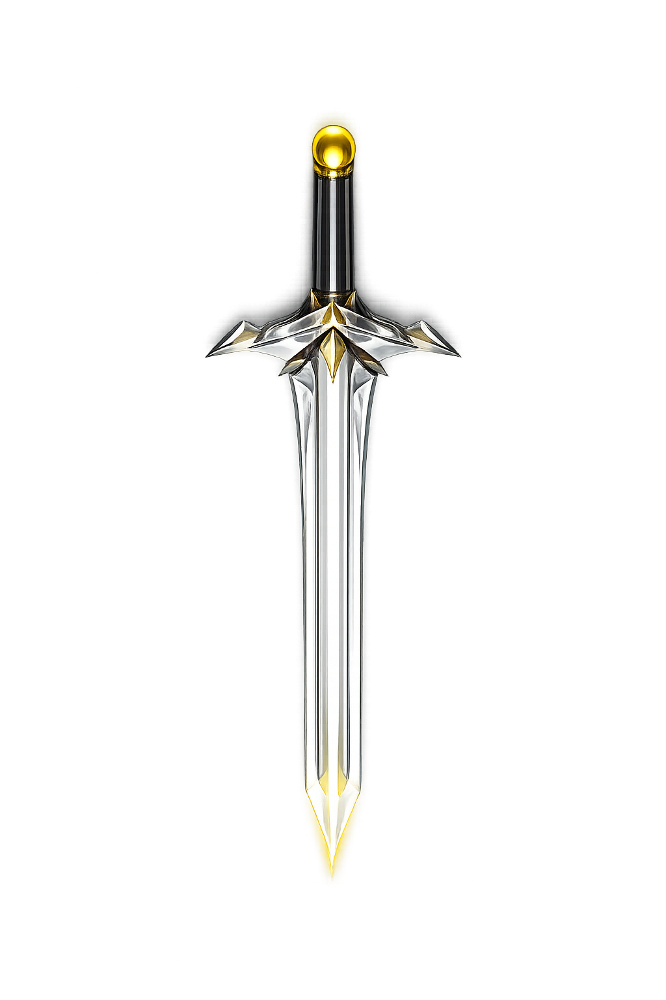

#  剑来 / Sword Come

**剑来** 是一个网页飞剑体验项目，通过 **手势识别控制剑的动作**，让你在浏览器中施展御剑、护阵、剑雨、万剑归宗等炫酷剑术。  

Sword Come is a browser-based sword simulation project. You can control flying swords with **hand gestures**, performing amazing sword techniques such as Sword Follow, Celestial Guard, Swords Rain, and Infinite Swords.

---

## 功能 Features

- 🎮 **手势控制 (Gesture Control)**  
  使用 **MediaPipe Hands** 识别单手手势切换剑术模式：  

  | 手势 | 模式 | 英文 |
  |------|------|------|
  | ☝️ 食指 | 御剑随行 | SWORD FOLLOW |
  | ✊ 握拳 | 天罡剑阵 | CELESTIAL GUARD |
  | 🖐️ 五指 | 剑雨星河 | SWORDS RAIN |
  | 🤟 食指+小指+拇指 | 万剑归宗 | INFINITE SWORDS |

  Control swords with **MediaPipe Hands** recognition: switch sword modes with hand gestures.

- ✨ **炫酷粒子飞剑效果 (Particle Sword Effects)**  
  剑身、剑柄、护手都通过 **Canvas 2D + 粒子系统**渲染，带有动态发光、旋转、深度感。  

  All sword parts are rendered with **Canvas 2D + particle system**, featuring glowing, rotation, and 3D depth effect.

- 🌌 **动态背景与 HUD (Dynamic Background & HUD)**  
  - 星空背景 + HUD 提示  
  - 当前剑术模式文字显示  
  - 模式切换过渡动画  

  Starry background + HUD; shows current sword mode with smooth transition animation.

- 🎵 **BGM & 音效 (BGM & Sound)**  
  自动渐入播放背景音乐，增强沉浸感。  

  Background music plays automatically with fade-in for immersive experience.

- ⚡ **多模式物理效果 (Multiple Sword Physics Modes)**  
  - 御剑随行: 剑沿手势轨迹飞行  
  - 剑雨: 剑从天而降，随机散开  
  - 万剑归宗: 五层剑阵旋转聚集  
  - 天罡剑阵: 剑形成护盾包围手势位置  

  - Sword Follow: swords follow hand trajectory  
  - Swords Rain: swords fall from sky randomly  
  - Infinite Swords: 5-layer rotating sword formation  
  - Celestial Guard: swords form shield around hand

---

## 技术栈 Tech Stack

- HTML5 + CSS3 + JavaScript  
- **Canvas 2D** 渲染粒子剑  
- **Tailwind CSS** 快速样式  
- **MediaPipe Hands** 手势识别  
- 音乐播放：HTML `<audio>`  

---

## 安装与运行 Run Locally

1. 克隆仓库 / Clone

```bash
git clone https://github.com/rael1022/Sword-Come.git

```

2. 打开 `sword_come.html` 即可体验，无需额外服务器。

Open `sword_come.html` in your browser, no server required.

> ⚠️ 注意：浏览器需要允许摄像头访问，手势控制才能生效。  
> ⚠️ Note: Camera access is required for gesture control.

---

## 使用说明 How to Play

- 打开网页，允许摄像头访问  
- 对着摄像头做指定手势切换剑术模式  
- 观察剑粒子响应手势运动  
- 尝试不同模式体验不同特效  

- Open the webpage and allow camera access  
- Make specific hand gestures to switch sword modes  
- Watch swords respond to your gestures  
- Try different modes for various effects

---

## 许可证 License

MIT License © 2026 Rael